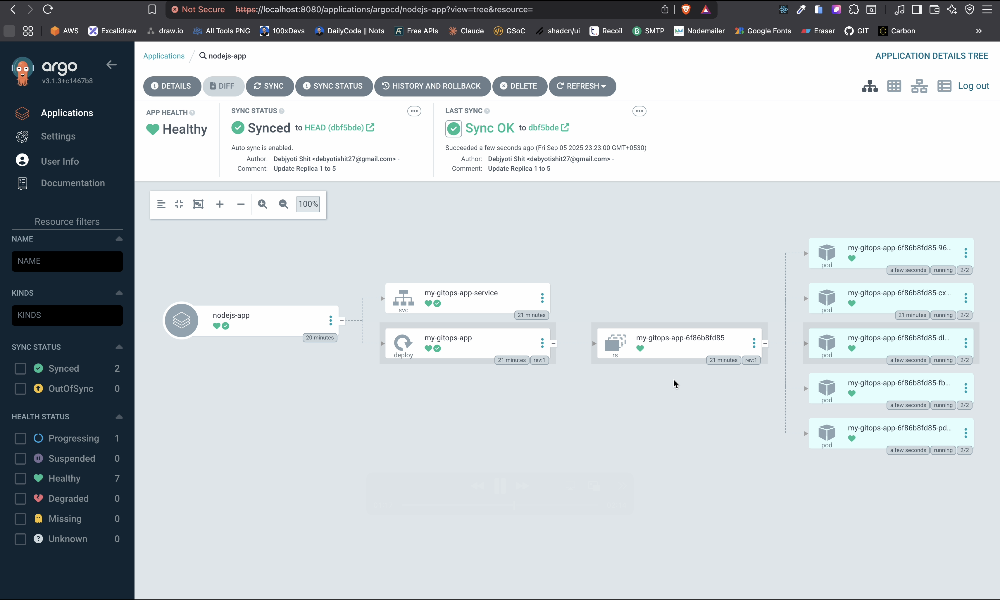

# GitOps Workflow with ArgoCD on Kubernetes

This project demonstrates a modern GitOps workflow using ArgoCD to manage a Kubernetes application's lifecycle. The core principle is to use a Git repository as the single source of truth for our infrastructure and application state. By managing our application declaratively through Git, we achieve a more reliable, transparent, and automated deployment process.

## Demo Link: [YouTube](https://www.youtube.com/watch?v=_7NUCfxV36A)

## Tools Used

- **Kubernetes Cluster**: Minikube

- **GitOps Tool**: ArgoCD

- **Source Control**: GitHub

- **Containerization**: Docker

## The GitOps Flow Explained

This section details the end-to-end process of deploying and updating an application using the implemented GitOps pipeline.

### Defining the Source of Truth in Git

The entire desired state of our application is defined declaratively in YAML manifests (`myapp.yaml`) and stored in this Git repository. This includes Kubernetes resources like Deployments and Services, specifying details such as the application's container image, the number of replicas, and service ports.

```yaml
apiVersion: apps/v1
kind: Deployment
metadata:
  name: my-gitops-app
spec:
  replicas: 1
  selector:
    matchLabels:
      app: my-gitops-app
  template:
    metadata:
      labels:
        app: my-gitops-app
    spec:
      containers:
        - name: myapp
          image: debjyoti08/nodejs-app
          ports:
            - containerPort: 3000
---
apiVersion: v1
kind: Service
metadata:
  name: my-gitops-app-service
spec:
  selector:
    app: my-gitops-app
  ports:
    - protocol: TCP
      port: 80
      targetPort: 3000
```

### ArgoCD Watches the Git Repository

An ArgoCD "Application" was configured to continuously monitor this repository. We pointed ArgoCD to this repo's URL, specified the `HEAD` revision to always follow the latest commit, and set the path to `k8s` to look for manifests in the root directory.

### The Initial Deployment (Automatic Sync)

Once the ArgoCD Application was created, it immediately performed the following actions:

- _Cloned_ this repository.

- Compared the state defined in `myapp.yaml`with the live state in the Kubernetes cluster.

- Detected that the application did not exist in the cluster (it was "OutOfSync").

- Applied the manifests to the cluster, creating the Deployment and Service.

- The application's status in the ArgoCD UI quickly became `Synced` and `Healthy`.

### Result of Initial Sync:


### Updating the Application via a Git Commit

```yaml
apiVersion: apps/v1
kind: Deployment
metadata:
  name: my-gitops-app
spec:
  replicas: 5
  selector:
    matchLabels:
      app: my-gitops-app
  template:
    metadata:
      labels:
        app: my-gitops-app
    spec:
      containers:
        - name: myapp
          image: debjyoti08/nodejs-app
          ports:
            - containerPort: 3000
---
apiVersion: v1
kind: Service
metadata:
  name: my-gitops-app-service
spec:
  selector:
    app: my-gitops-app
  ports:
    - protocol: TCP
      port: 80
      targetPort: 3000
```

### ArgoCD Detects the Change and Re-syncs

Within moments of pushing the commit, ArgoCD's control loop performed these steps automatically:

- **Detected** the new commit in the repository.

- **Compared** the new desired state (v2, 3 replicas) with the live state in the cluster (v1, 1 replica).

- **Identified** the difference and marked the application as `OutOfSync`.

- Because automatic syncing was enabled, ArgoCD immediately began a rolling update on the Deployment in Kubernetes to match the new state from Git.

- Once the rolling update was complete, the application status returned to `Synced` and `Healthy`.

### Result of the Git-Triggered Update:


---
1. Project 1 : https://github.com/Debjyoti2004/CI-CD-Pipeline-with-GitHub-Actions-Docker?tab=readme-ov-file
2. project 2 : https://github.com/Debjyoti2004/Scalable-Static-Website-with-S3-Cloudflare-GitHub-Actions
3. project 3 : https://github.com/Debjyoti2004/ArgoCD-on-Kubernetes
4. project 4 : https://github.com/Debjyoti2004/ArgoCD-on-Kubernetes 
